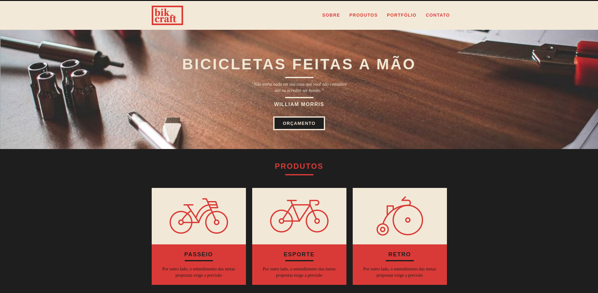

# Bikcraft



Bikcraft was the first project that I completed after my start programming.

## Installation

1. Clone the repository:

```bash
git clone https://github.com/mat-alcantara/bikcraft.git
```

2. Go to the project's folder

```bash
cd bikcraft
```

## Usage

You only need to open index.html to have access to the entire website

## License

[MIT](https://choosealicense.com/licenses/mit/)
